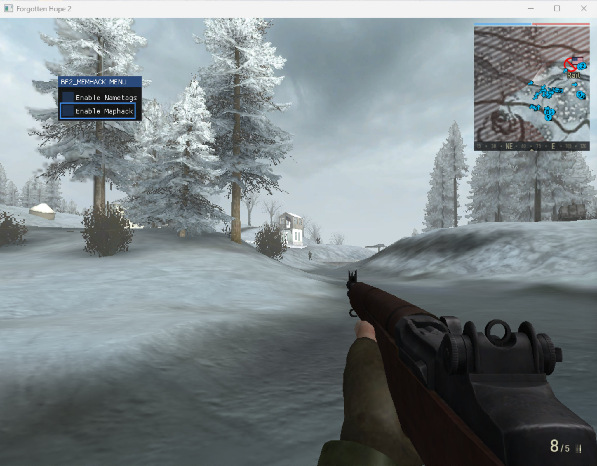
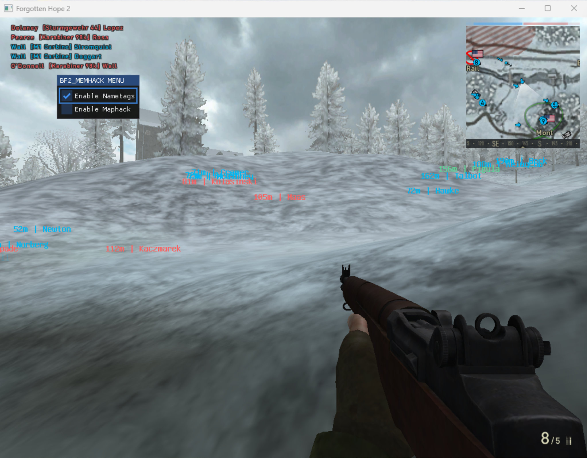
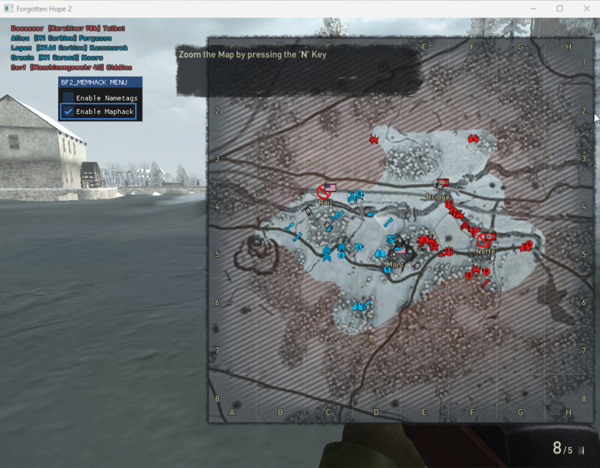
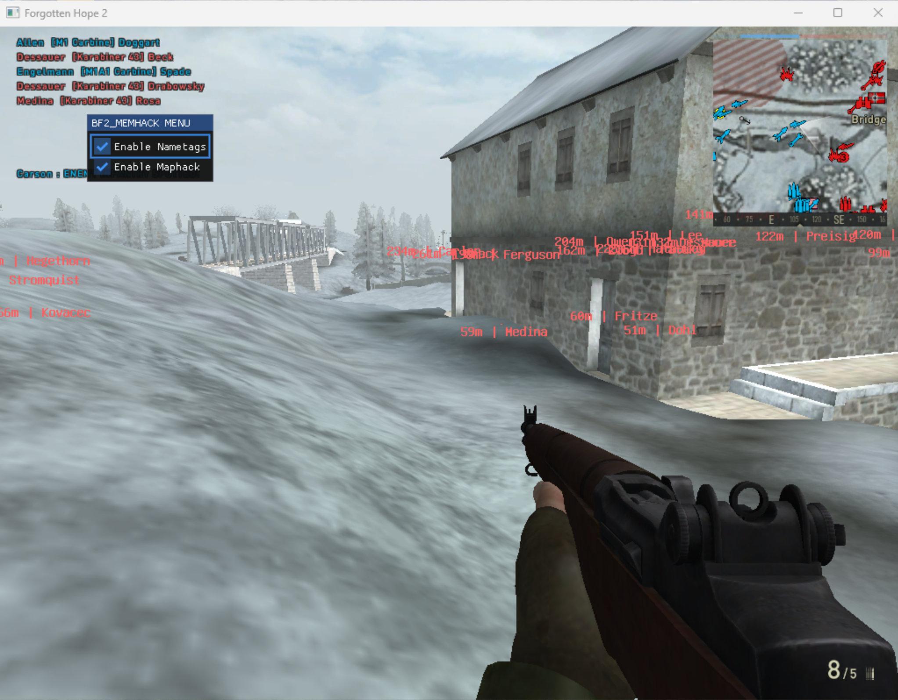

# bf_memhack_v2

A simple internal Battlefield 2 cheat that lets you toggle player nametags and maphack. It works with Battlefield 2, Forgotten Hope 2 and Project Reality.


## Features

- **NameTags**
  Draws player names and distances above their heads.
- **MapHack**
  Reveals the enemy positions on the minimap.
- **In‑Game UI**
  Minimal on‑screen menu for toggling features. Press **F12** to show/hide the menu


## Dependencies

- MinGW Win32 cross‑compiler (i686-w64-mingw32-g++)
- [vcpkg](https://github.com/Microsoft/vcpkg)
- [CMake](https://cmake.org/)
- [Ninja](https://ninja-build.org/)

Make sure all dependencies are installed and properly configured in your PATH.


## How to Build

```bash
1. Clone the repo
   # git clone https://github.com/yourname/bf_memhack_v2.git
   # cd bf_memhack_v2
2. Clone and bootstrap vcpkg
3. Run the build.sh script at the root of the project
```

## Third-Party Libraries

- **Dear ImGui** - see [licenses/imgui_copyright](./licenses/imgui_copyright)
- **MinHook** - see [licenses/minhook_copyright](./licenses/minhook_copyright)


## Screenshots







## ⚠️ Disclaimer
This code is provided for educational purposes only. Use at your own risk.
